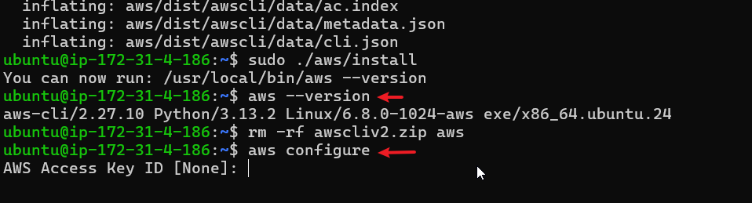
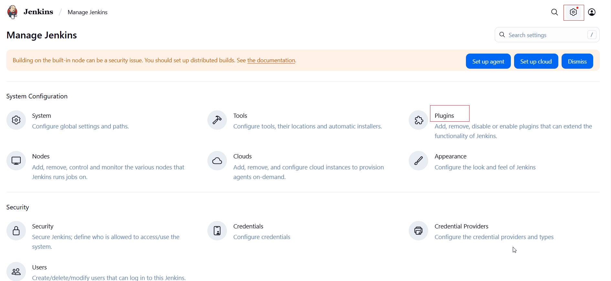
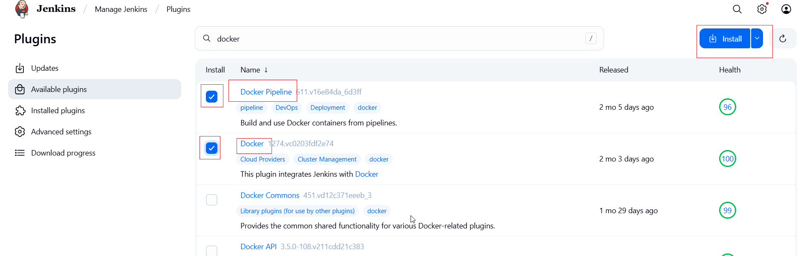

# Deploy-Helm-Chart-to-Kubernetes-using-Jenkins-pipeline


## Install Dependencies:

1)	Install docker: first Set up Docker's apt repository: 


# Add Docker's official GPG key:
sudo apt-get update
sudo apt-get install ca-certificates curl
sudo install -m 0755 -d /etc/apt/keyrings
sudo curl -fsSL https://download.docker.com/linux/ubuntu/gpg -o /etc/apt/keyrings/docker.asc
sudo chmod a+r /etc/apt/keyrings/docker.asc

# Add the repository to Apt sources:
echo \
  "deb [arch=$(dpkg --print-architecture) signed-by=/etc/apt/keyrings/docker.asc] https://download.docker.com/linux/ubuntu \
  $(. /etc/os-release && echo "${UBUNTU_CODENAME:-$VERSION_CODENAME}") stable" | \
  sudo tee /etc/apt/sources.list.d/docker.list > /dev/null
sudo apt-get update


b)	Install the Docker packages:
sudo apt-get install docker-ce docker-ce-cli containerd.io docker-buildx-plugin docker-compose-plugin


c) post installation: To create the docker group and add your user:
i) Create the docker group:
sudo groupadd docker

ii) Add your user to the docker group.
```
 sudo usermod -aG docker $USER
```
iii) Log out and log back in so that your group membership is re-evaluated.
If you're running Linux in a virtual machine, it may be necessary to restart the virtual machine for changes to take effect.
You can also run the following command to activate the changes to groups:
```
newgrp docker
```

Verify that you can run docker commands without sudo.
This command downloads a test image and runs it in a container. When the container runs, it prints a message and exits.
```
 docker run hello-world
```


2)	Install minicube: google ‘install minikube’ and choose linux as what u are installing it on, then copy the code there:
```
curl -LO https://github.com/kubernetes/minikube/releases/latest/download/minikube-linux-amd64
sudo install minikube-linux-amd64 /usr/local/bin/minikube && rm minikube-linux-amd64
```
2a) Start minikube:

```
minikube start
```

3) install kubectl: google 

```
sudo apt-get update
# apt-transport-https may be a dummy package; if so, you can skip that package
sudo apt-get install -y apt-transport-https ca-certificates curl gnupg

```

```
curl -fsSL https://pkgs.k8s.io/core:/stable:/v1.33/deb/Release.key | sudo gpg --dearmor -o /etc/apt/keyrings/kubernetes-apt-keyring.gpg
sudo chmod 644 /etc/apt/keyrings/kubernetes-apt-keyring.gpg # allow unprivileged APT programs to read this keyring
```
```
echo 'deb [signed-by=/etc/apt/keyrings/kubernetes-apt-keyring.gpg] https://pkgs.k8s.io/core:/stable:/v1.33/deb/ /' | sudo tee /etc/apt/sources.list.d/kubernetes.list
sudo chmod 644 /etc/apt/sources.list.d/kubernetes.list   # helps tools such as command-not-found to work correctly
```

```
sudo apt-get update
sudo apt-get install -y kubectl
```

# confirm kubectl has been installed:

```
kubectl version --client
```
# Install Helm:

```
curl https://baltocdn.com/helm/signing.asc | gpg --dearmor | sudo tee /usr/share/keyrings/helm.gpg > /dev/null
sudo apt-get install apt-transport-https --yes
echo "deb [arch=$(dpkg --print-architecture) signed-by=/usr/share/keyrings/helm.gpg] https://baltocdn.com/helm/stable/debian/ all main" | sudo tee /etc/apt/sources.list.d/helm-stable-debian.list
sudo apt-get update
sudo apt-get install helm
```

confirm Helm is installed:

```
helm version
```

# INSTALL  AWS CLI:

```
sudo apt update
```
2. Install Dependencies
Ensure you have the necessary dependencies installed:

```
sudo apt install -y unzip curl
```
3. Download the AWS CLI Installer
Use curl to download the AWS CLI v2 installer:

```
curl "https://awscli.amazonaws.com/awscli-exe-linux-x86_64.zip" -o "awscliv2.zip"
```
4. Extract the Installer
Unzip the downloaded file:

```
unzip awscliv2.zip
```
5. Run the Installer
Run the installation script:

```
sudo ./aws/install
```
6. Verify the Installation
Confirm that the AWS CLI is installed and check its version:

```
aws --version
```
You should see output similar to:

aws-cli/2.x.x Python/x.x.x Linux/x.x.x

7. Clean Up
(Optional) Remove the downloaded files to free up space:

```
rm -rf awscliv2.zip aws
```
8. Configure the AWS CLI
Set up your AWS credentials:

```
aws configure
```
You’ll need to provide:

Access Key ID
Secret Access Key
Default region (e.g., us-east-1)
Output format (e.g., json, text, or table)

# install eksctl:

```
# for ARM systems, set ARCH to: `arm64`, `armv6` or `armv7`
ARCH=amd64
PLATFORM=$(uname -s)_$ARCH

curl -sLO "https://github.com/eksctl-io/eksctl/releases/latest/download/eksctl_$PLATFORM.tar.gz"

# (Optional) Verify checksum
curl -sL "https://github.com/eksctl-io/eksctl/releases/latest/download/eksctl_checksums.txt" | grep $PLATFORM | sha256sum --check

tar -xzf eksctl_$PLATFORM.tar.gz -C /tmp && rm eksctl_$PLATFORM.tar.gz

sudo mv /tmp/eksctl /usr/local/bin
```
CHECK IF EKSCTL is installed:

```
eksctl version
```

Install Jenkins:

Installation of Java
Jenkins requires Java to run, yet not all Linux distributions include Java by default. Additionally, not all Java versions are compatible with Jenkins.

There are multiple Java implementations which you can use. OpenJDK is the most popular one at the moment, we will use it in this guide.

Update the Debian apt repositories, install OpenJDK 21, and check the installation with the commands:

```
sudo apt update
sudo apt install fontconfig openjdk-21-jre
java -version
openjdk version "21.0.3" 2024-04-16
OpenJDK Runtime Environment (build 21.0.3+11-Debian-2)
OpenJDK 64-Bit Server VM (build 21.0.3+11-Debian-2, mixed mode, sharing)
```

INSATLL JENKINS:

```
sudo wget -O /etc/apt/keyrings/jenkins-keyring.asc \
  https://pkg.jenkins.io/debian-stable/jenkins.io-2023.key
echo "deb [signed-by=/etc/apt/keyrings/jenkins-keyring.asc]" \
  https://pkg.jenkins.io/debian-stable binary/ | sudo tee \
  /etc/apt/sources.list.d/jenkins.list > /dev/null
sudo apt-get update
sudo apt-get install jenkins
```

# Start Jenkins:

You can enable the Jenkins service to start at boot with the command:

```
sudo systemctl enable jenkins
```

You can start the Jenkins service with the command:

```
sudo systemctl start jenkins
```

You can check the status of the Jenkins service using the command:

```
sudo systemctl status jenkins
```
# ADD jenkins to docker group

```
sudo usermod -aG docker jenkins
```

```
sudo systemctl restart jenkins
```
- check that it is added:

```
groups jenkins
```
OR
```
sudo grep docker /etc/group
```
## set-up jenkins server

To get the administrative password, on your terminal paste the below command:

```
sudo cat /var/lib/jenkins/secrets/initialAdminPassword
```

## CREAT IAM ROLE AND ATTACH TO JENKINS SERVER


## SET UP EKS CLUSTER

>> TO set up eks cluster, u hv to ist change to jenkins user:

```
sudo su - jenkins
```

- create eks cluster using the below command:

```
eksctl create cluster --name eks-millyscluster --region us-west-2 --nodegroup-name millys-eks-grp --node-type t2.medium --managed --nodes 2
```
THE CLUSTER WILL TALE 15-20MINS TO SET-UP so you can skip to jenkins set-up wwhile waiting

To veiw the nodes created: but ist ensure you are in as jenkins user, then run the command
```
 kubectl get nodes
```
- Create namespaces:
You can use the default namespaces but it is best practice to create your own namespace

```
kubectl create ns helm-deployment
```
confirm namespace has been created:

```
kubectl get ns
```

# TO CLEAN UP
delete cluster

```
eksctl delete cluster --name eks-millyscluster --region us-west-2
```

## INSTALL PLUGINS INTO JENKINS
 
 install docker and docker pipeline

 

 


 ```
 kubectl get pods -n helm-deployment
 ```

 ```
kubectl get svc -n helm-deployment
 ```

